# Sentiment ANalysis Bot

## See the bot in action

Join the slack workspace ---> [here](https://join.slack.com/t/sentiment-bot/shared_invite/zt-16bjybl1f-369uKOLoEMtapDQa5T3j~Q)

Send a message to ---> [this channel](https://sentiment-bot.slack.com/archives/C03A06B5EN4)

## Deploy your own bot

### Prerequisites

Ensure you are running a bash like terminal, WSL would be suitable for Windows and standard terminal is fine for MacOS

Ensure you have the following programs installed:

- GNU Make (Comes standard on most machines)
- Docker. Can be installed [here](https://docs.docker.com/get-docker/)
- Docker Compose. Installation instructions can be found [here](https://docs.docker.com/compose/install/)

This also assumes that you have a slack account and a workplace already created.

This deploys into a GCP project. Ensure you have a GCP project already and keep your GCP project ID value handy.

Note: All the secret tokens used in the screenshots have been regenerated and no longer work ;)

Another Note: All commands should be executed in the root of this repository (The same directory the MakeFile is located in)

### Deployment steps

1. Navigate to https://api.slack.com/apps and click on <b>Create New App</b>

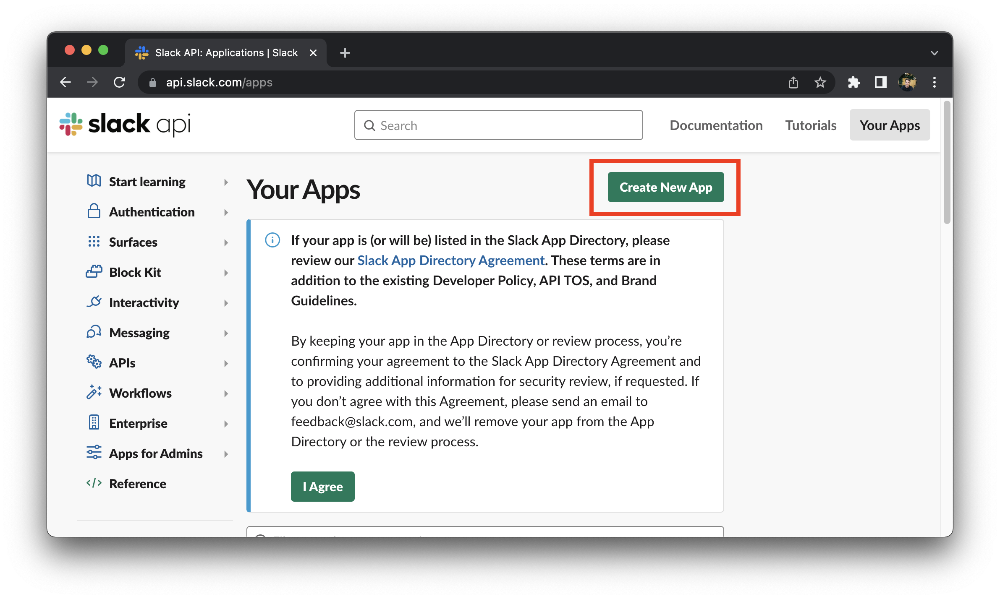

2. Select the workspace you wish to install this app into from the dropdown and then click <b>Next</b>

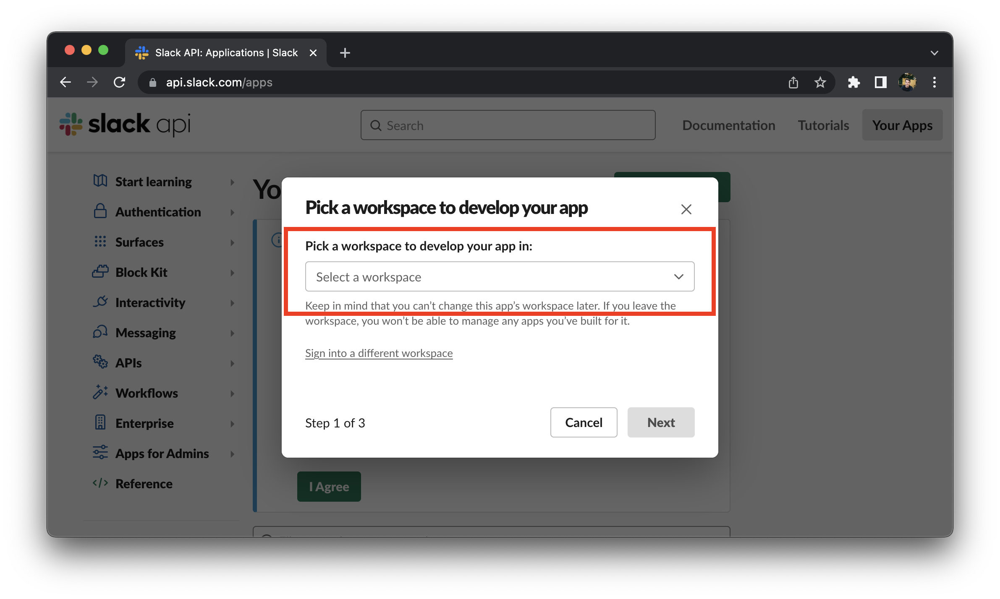


3. Choose <b>From an app manifest</b>

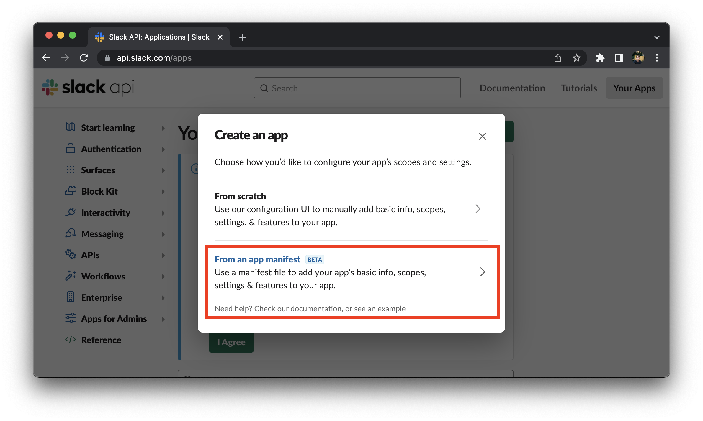

4. Copy the template app manifest from [here](./slack-config/app-manifest.yaml) and paste it into the text box where it is asking for the manifest code. Then click <b>Next</b>

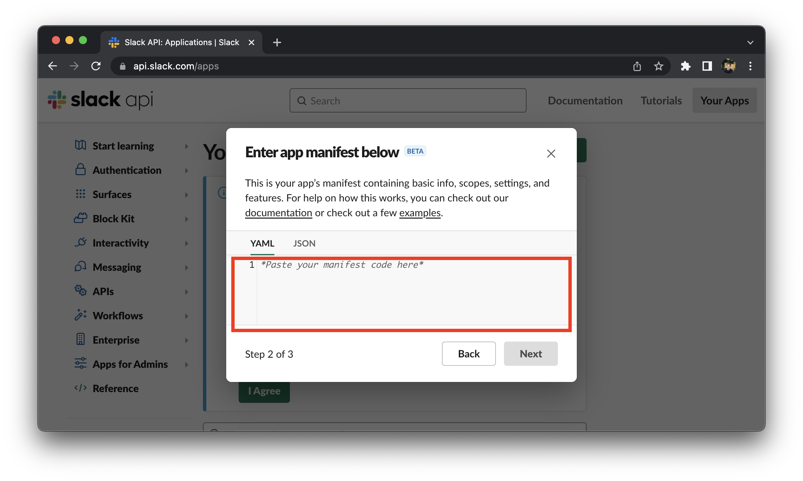

5. Review the permissions being granted. These permissions are defined in the app manifest and are required for this bot to function correctly. Once you are happy with granting these scopes to your app click <b>Create</b>

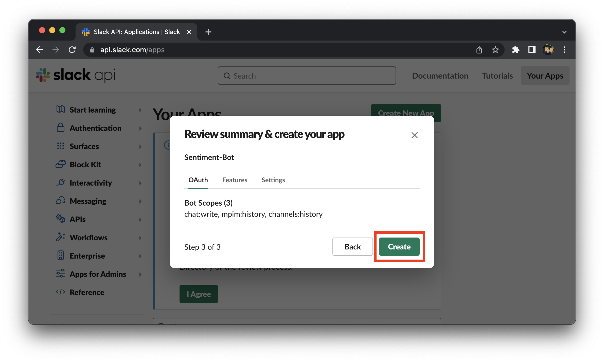

6. Install the app to your workplace, this allows you to generate the oauth token required to reply to messages in slack

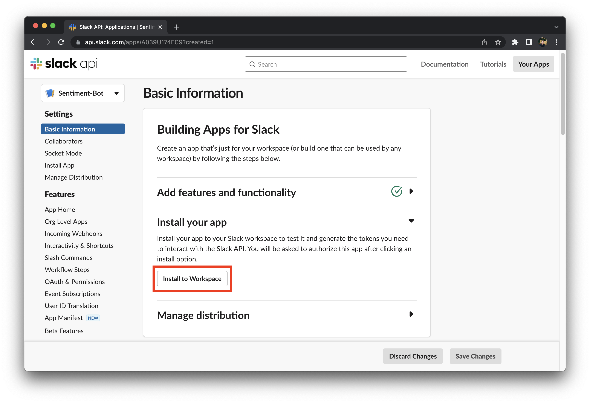

7. Click <b>Allow</b>

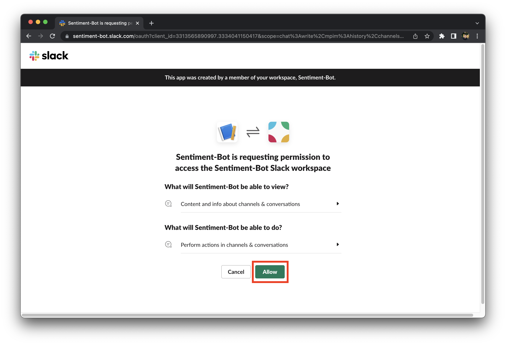


8. Open a terminal and navigate to the root of this repository then run the following command. This will create your own .env file for you to insert your variable values into.

```
make env
```

9. In the basic information tab of your installed app copy the value for the generated <b>Signing Secret</b> and use it for the value of `TF_VAR_slack_signing_secret` in the generated [.env](.env) file.

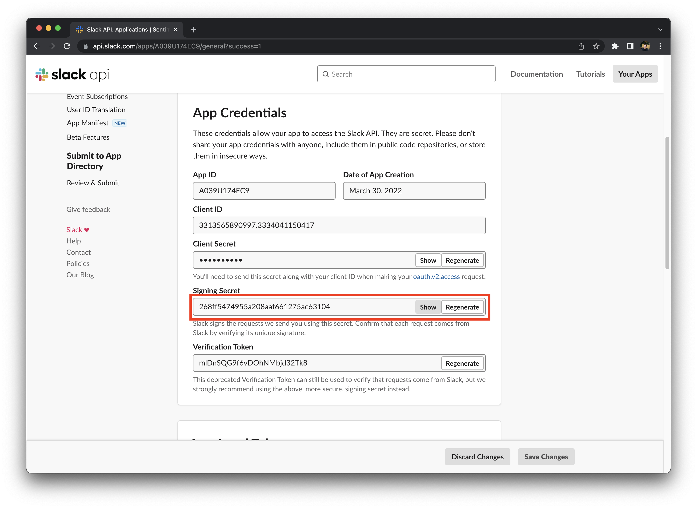

10. Navigate to the <b>Oauth & Permissions</b> tab.

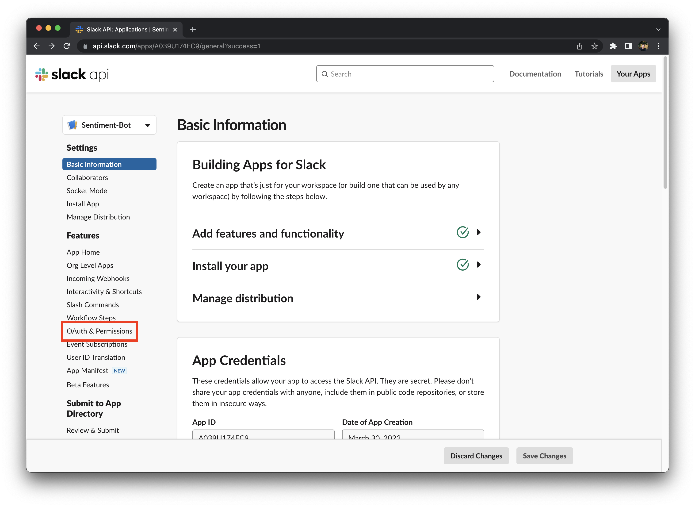

11. Copy the generated <b>Bot User OAuth Token</b> and use it for the value of `TF_VAR_slack_oauth_token` in the generated [.env](.env) file.

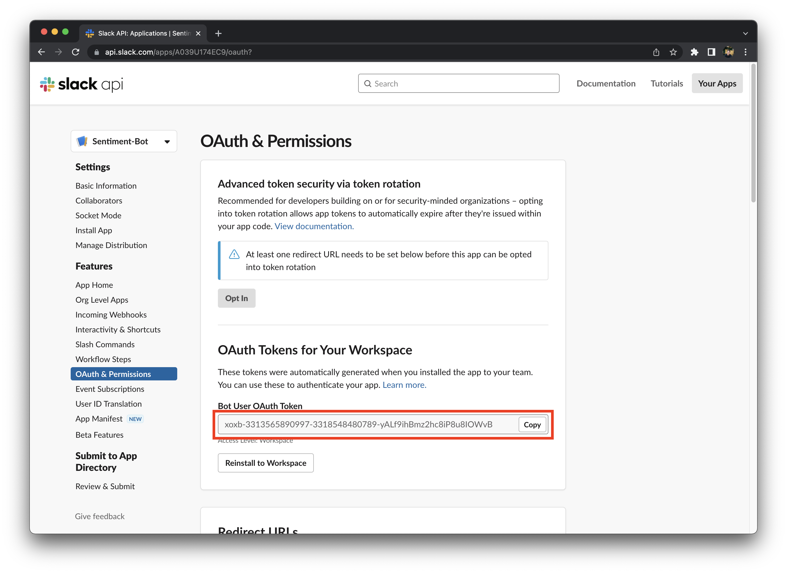

12. Insert your <b>GCP Project ID</b> into the value for `TF_VAR_gcp_project_id` in the generated [.env](.env) file.

13. Your [.env](.env) file should look something like this

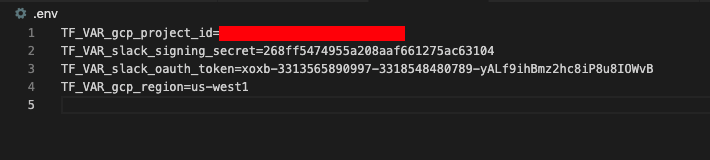

14. Run the following command to login to GCP and store your credentials for <b>Terrafom</b> to use to deploy this to your GCP project. This command will only need to be run once. Follow the prompts in your terminal

```
make login
```

15. Once logged run the following command to deploy this app into gcp.

```
make deploy
```

16. After the deployment has completed (this can take several minutes) you will see a value outputted for the `entry_point_invoke_url` copy this value.

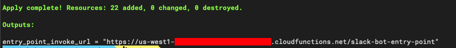

17. Navigate to the <b>Event Subscriptions</b> tab in the slack api website

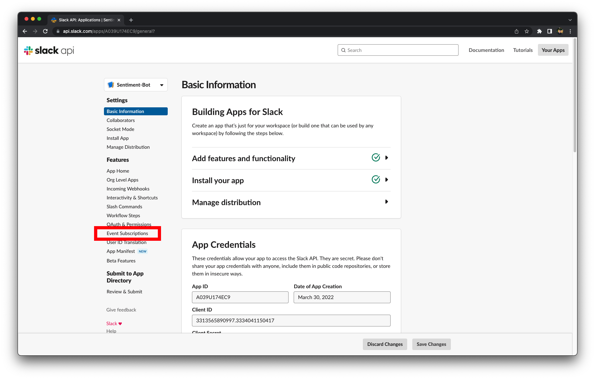

18. Insert the copied value for `entry_point_invoke_url` into the text box and ensure you click save

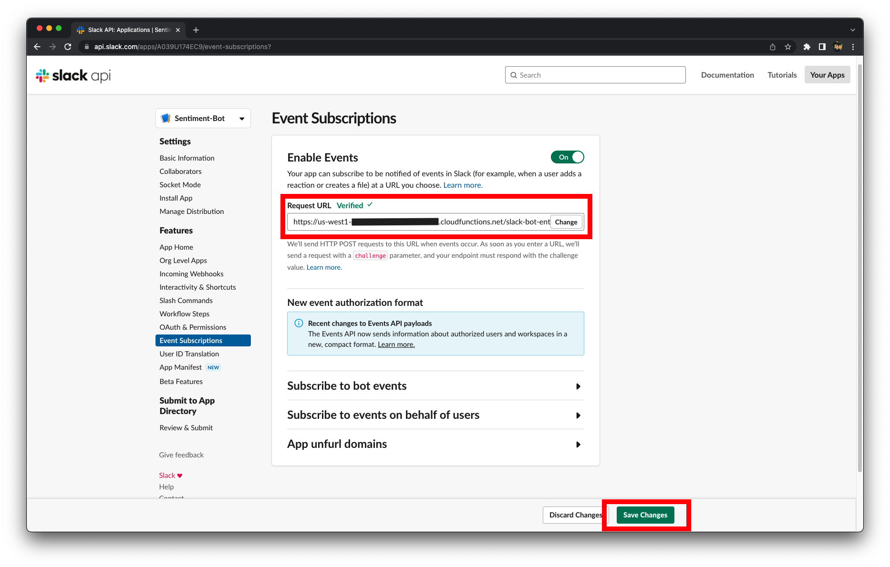

19. Navigate to a channel you want to add the sentiment bot to and open the channel's settings

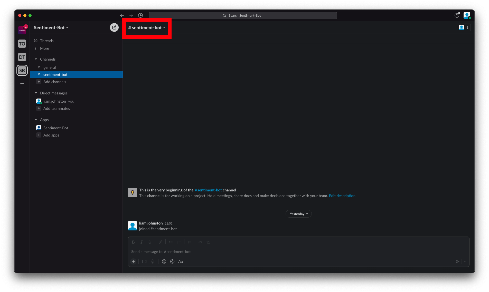

20. Click intergrations and then <b>Add an app</b>

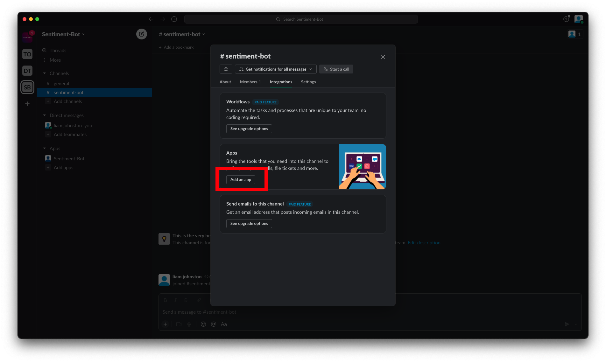

21. You should see your app at the top of the list click add and you should be up and running!

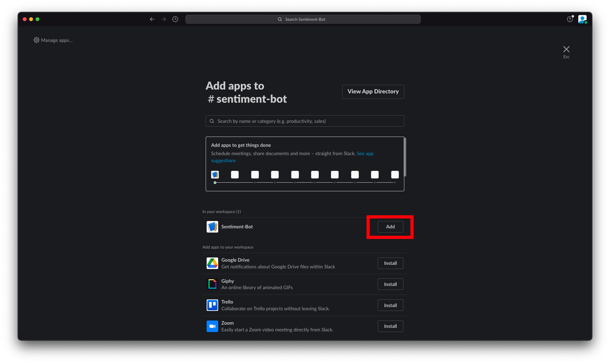

## Tech problems

I will be most responsive in the slack workspace, join the slack workspace [here](https://join.slack.com/t/sentiment-bot/shared_invite/zt-16bjybl1f-369uKOLoEMtapDQa5T3j~Q) and ask a question in [this channel](https://sentiment-bot.slack.com/archives/C039FNNF0QK)
